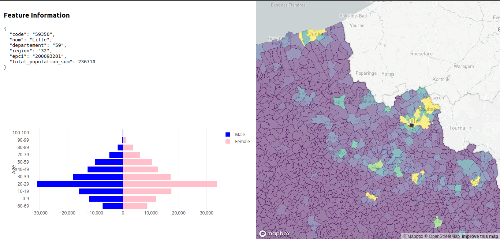

# 🚧 GeoDemographics Dashboard

This project is an ongoing web application that renders a choropleth map of France's cities, displaying demographic information using vector tiles and interactive demographic pyramid charts. It is built with a modern web application stack for efficient, dynamic, and responsive user experience.

> **Note**: This project is under active development. Some features are in progress and may not yet be fully functional. 🚧

## Tech Stack 

- **Frontend**: React, Plotly.js, Mapbox GL JS
- **Backend**: Flask
- **Vector Tile Rendering**: **Tippecanoe** is used to generate vector tiles, while **Tileserver-GL** serves them to the frontend for fast rendering.
- **Mapping**: Mapbox GL JS for interactive map rendering
- **Data Visualization**: Plotly.js for dynamic demographic pyramid charts

## Features 

- **Interactive Choropleth Map**: A choropleth map of France's cities, rendering vector tiles using **Mapbox GL JS**.
- **Demographic Pyramid Charts**: Each city displays a demographic pyramid chart showing population distribution by age and gender.
- **Dynamic Data Loading**: Data is fetched and displayed dynamically via the Flask backend and postgreSQL database.

## Screenshots

Here’s a preview of what the app looks like in its current stage:

